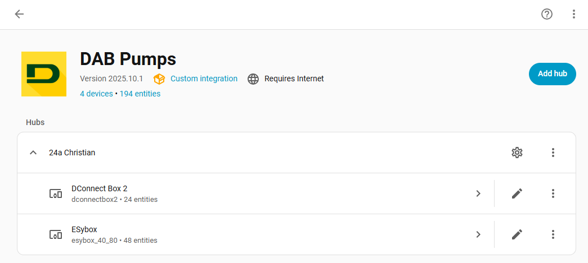

[](https://github.com/ankohanse/hass-dab-pumps)
[](https://github.com/custom-components/hacs)
[](https://github.com/ankohanse/hass-dab-pumps)
[](https://github.com/ankohanse/hass-dab-pumps)<br/>
[](https://github.com/ankohanse/hass-dab-pumps/blob/main/LICENSE)
[](https://www.buymeacoffee.com/ankohanse)


# Hass-DAB-Pumps

[Home Assistant](https://home-assistant.io/) custom component for retrieving sensor information from DAB Pumps devices.
This component connect to the remote DAB Pumps servers and automatically determines which installations and devices are available there.

The custom component was tested with a ESybox 1.5kw combined with a DConnect Box 2. 
It has also been reported to function correctly for ESybox Mini and ESybox Diver.


# Prerequisites
This integration depends on the backend servers for the DAB Pumps H2D app, DAB Live app or DConnect app to retrieve the device information from.

- For most pumps:

  All DAB's new network-capable pumps will progressively be connected with H2D. At the moment, H2D is supported by Esybox Mini3, Esybox Max, NGPanel, NGDrive and the new EsyBox.

  Newer pump devices will have integrated connectivity (Esybox MAX and Esybox Mini), while older pumps might require a DConnect Box/Box2 device (Esybox and Esybox Diver).

  Using free functionalilty you will be able to check the system's basic parameters via the H2D app and this Home Assistant integration. To allow to edit settings via the H2D app and this integration you will need a Dab Pumps subscription to premium H2D. Follow the steps under [H2D](#h2d)

- For other pumps:

  The older Dab Live and DConnect apps are being replaced by H2D, but are still available.

  Esybox Mini3 pumps are supported on the DAB Live app with a free DAB Live account, or on the DConnect App with a paid account. Follow the steps under either [DAB Live](#dab-live) or [DConnect](#dconnect).

  To see whether your pump device is supported via DConnect, browse to [internetofpumps.com](https://internetofpumps.com/), select 'Professional Users' and scroll down to the operation diagram. A free trial period is available, after that there is a yearly subscription to DAB Pumps DConnect (US$ 20 in 2024). Follow the steps under [DConnect](#dconnect).

## H2D
If you have a pump that is supported by the H2D app then:
- Download the H2D app on your phone or tablet
- Setup an account to use with the app.
- Follow the steps in the app to register your pump.
- Create a separate account for use with this Home Assistant integration; follow the steps under  [Multiple Account Logins](#multiple-account-logins) below.

## DAB Live
If you have a pump that is supported for DAB Live then:
- Download the DAB Live app on your phone or tablet
- Open the app and create a new account. When asked between 'Professional' or 'End User' either are good, this has no implications on the app or the Home Assistant Integration.
- Follow the steps in the app to register your pump
- Finally, setup the Home Assistant integration via the steps under [Installation](#installation)

## DConnect
If you have a device that is supported for DConnect then:
- Enable your DAB Pumps devices to connect to DConnect. For more information on this, see the manual of your device.
- Install the DConnect app, or open the DConnect website in a browser.
- Setup an account for DConnect.
- Add your installation via the device serial number.
- Setup a sepatate account for use with this Home Assistant integration; follow the steps under  [Multiple Account Logins](#multiple-account-logins) below.

## Multiple Account Logins
The H2D app and the DConnect app and website seem to have a problem with multiple logins from the same account. I.e. when already logged into the app or website, then a subsequent login via this Home Assistant integration may fail. 

Therefore it is recommended to create a separate account within DAB Pumps H2D or DConnect that is specific for use with Home Assistant.

- Create a fresh email address at gmail, outlook or another provider. 

- For H2D:
  - Login to the H2D app using your regular email address.
  - In the bottom of the H2D app select 'Installations'.
  - At the top of the page the owner is displayed. This is the name associated with your regular email address. Press the '>' next to it.
  - Click on '+ Invite another user'.
  - Fill in the email address you created specific for Home Assistant use. Select user category 'Professional' to make use of all functionality of this library. Press 'Invite' and then 'Continue'.
  - Follow the steps as described in the invitation email to register the new email address. Note that this is handled via the DConnect website (which is expected to be renamed to H2D soon).

- For DConnect:
  - Open the Dconnect app and logout from your normal account if needed.
  - Press 'Login' and then 'Register'. This will open the DConnect website.
  - Enter the email address you created for Home Assistant use and choose a password. The choice between 'Professional' or 'End User' either are good as this is only used for marketing purposes;  it has no implications on the website, app or this library.
  - Fill in all other details on the form and press 'Register'.
  - Go back to the DConnect app and login using your normal account.
  - Click on your installation and then at the bottom of the page on 'Installation Sharing'.
  - Click on 'Add an installer' to make use of all functionality of this library.
  - Fill in the email address you created specific for script use and click '+'. 


# Installation

## HACS
This custom integration is avalable via HACS (Home Assistant Community Store).
1. In the HACS page, search for 'DAB Pumps'.
2. Click on the found item to display its readMe (this page).
3. At the bottom of the page press 'Download'
2. Restart Home Assistant.
3. Follow the UI based [Configuration](#configuration)


## Manual install
1. Under the `<config directory>/custom_components/` directory create a directory called `dabpumps`. 
Copying all files in `/custom_components/dabpumps/` folder from this repo into the new `<config directory>/custom_components/dabpumps/` directory you just created.

    This is how your custom_components directory should look like:

    ```bash
    custom_components
    ├── dabpumps
    │   ├── translations
    │   │   └── en.json
    │   ├── __init__.py
    │   ├── api.py
    │   ├── binary_sensor.py
    │   ├── button.py
    │   ├── config_flow.py
    │   ├── const.py
    │   ├── coordinator.py
    │   ├── diagnostics.py
    │   ├── entity_base.py
    │   ├── entity_helper.py
    │   ├── manifest.json
    │   ├── number.py
    │   ├── select.py
    │   ├── sensor.py
    │   ├── store.py
    │   ├── strings.json
    │   ├── switch.py
    │   └── time.py  
    ```

2. Restart Home Assistant.
3. Follow the UI based [Configuration](#configuration)

# Configuration
To start the setup of this custom integration:
- go to Home Assistant's Integration Dashboard
- Add Integration
- Search for 'DAB Pumps'
- Follow the prompts in the configuration step

## Step 1 - Connection details
The following properties are required to connect to the Dab Pumps servers:
- Username: email address as registered for Home Assistant use in H2D, DAB Live or DConnect
- Password: password associated with the username
  


## Step 2 - Installations
If your account is only assiciated with one DAB Pumps installation then this step is automatically skipped.

Otherwise, select the DAB Pumps installation to use in Home Assistant. The other DAB Pumps installations can be added to the integration later on.


## Step 3 - User role
If your account already has user role Professional/Installer then this step is automatically skipped.

To enable all functionality of this integration, the role Professional/Installer is required. Select to update to this role, or you can choose to keep the existing user role.


## Devices
After succcessful setup, all devices from the DAB Pumps installation should show up in a list.



On the individual device pages, the hardware related device information is displayed, together with sensors typically grouped into main entity sensors, controls and diagnostics.

Any sensors that you do not need can be manually disabled using the Home Assistant integration pages.


If the chosen user account has role Professional/Installer, then several entities will be available for configuration. When using role Private/Customer these will be includes as read-only sensors instead.


## Sensors
Sensors are registered to each device as `sensor.{device_name}_{sensor_name}` with an easy to read friendly name of `sensor_name`. 
  


# Troubleshooting
Please set your logging for the this custom component to debug during initial setup phase. If everything works well, you are safe to remove the debug logging:

```yaml
logger:
  default: warn
  logs:
    custom_components.dabpumps: debug
```


# Knowledge base
For additional suggestions and tips&trick, see the  separate [knowledge base](https://github.com/ankohanse/hass-dab-pumps/blob/master/KNOWLEDGE_BASE.md) document.


# Credits

Special thanks to the following people for their testing and feedback on the first versions of this custom integration:
- [Djavdeteg](https://github.com/Djavdeteg) on ESybox Mini 3
- [Coldness00](https://github.com/Coldness00) on ESybox Mini 3
- [benjaminmurray](https://github.com/benjaminmurray) on ESybox Mini 3
- [nicopret1](https://github.com/nicopret1) on ESybox Mini 3
- [hannovdm](https://github.com/hannovdm) on ESybox V2
- [Bascht74](https://github.com/Bascht74) on ESybox Diver (with fluid add-on)
- [Deshan Pillay](https://github.com/Desh86) on the DAB Live connectivity

And for the translations:
- [ViPeR5000](https://github.com/ViPeR5000) for Portugese

