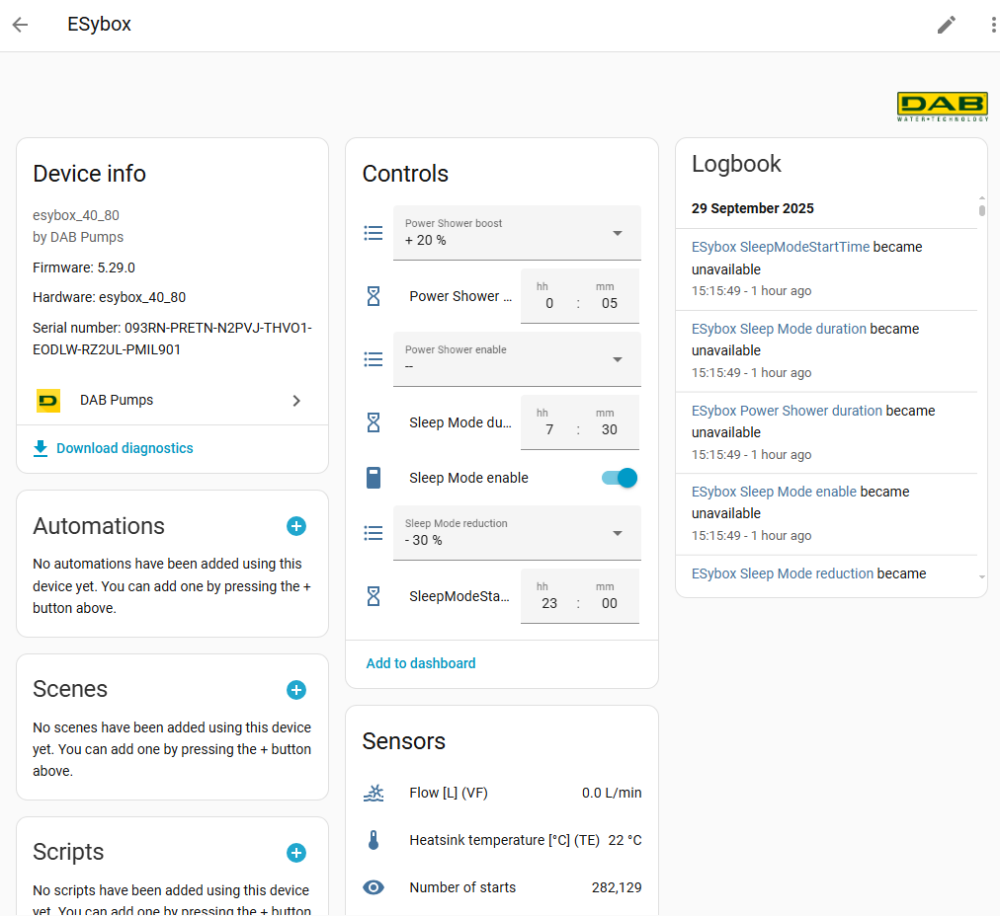

[](https://github.com/ankohanse/hass-dab-pumps)
[](https://github.com/custom-components/hacs)
[](https://github.com/ankohanse/hass-dab-pumps)<br/>
[](LICENSE)
[](https://www.buymeacoffee.com/ankohanse)


# Hass-DAB-Pumps

[Home Assistant](https://home-assistant.io/) custom component for retrieving sensor information from DAB Pumps devices.
This component uses webservices to connect to the DAB Pumps DConnect website and automatically determines which installations and devices are available there.

The custom component was tested with a ESybox 1.5kw combined with a DConnect Box 2. 
It has also been reported to function correctly for ESybox Mini and ESybox Diver.


# Prerequisites
This device depends on the backend servers for the DAB Pumps DAB Live app and DConnect app to retrieve the device information from.

- For ESybox Mini3 pumps:

  These are supported on the DAB Live app with a free DAB Live account, or on the DConnect App with a paid account. Follow the steps under either [DAB Live](#dab-live) or [DConnect](#dconnect).

- For other pumps:

  To see whether your pump device is supported via DConnect, browse to [internetofpumps.com](https://internetofpumps.com/), select 'Professional Users' and scroll down to the operation diagram. Some pump devices will have integrated connectivity (Esybox MAX and Esybox Mini), others might require a DConnect Box/Box2 device (Esybox and Esybox Diver). A free trial period is available, after that there is a yearly subscription to DAB Pumps DConnect (US$ 20 in 2024). Follow the steps under [DConnect](#dconnect).

## DAB Live
If you have a pump that is supported for DAB Live then:
- Download the DAB Live app on your phone or tablet
- Open the app and create a new account. When asked between 'Professional' or 'End User' either are good, this has no implications on the app or the Home Assistant Integration.
- Remember the email address and password for the account as these are needed during setup of this Home Assistant integration.
- Follow the steps in the app to register your pump
- Finally, setup the Home Assistant integration via the steps under [Installation](#installation)

## DConnect
If you have a device that is supported for DConnect then:
- Enable your DAB Pumps devices to connect to DConnect. For more information on this, see the manual of your device.
- Install the DConnect app, or open the DConnect website in a browser.
- Setup an account for DConnect, see the remarks under 'DConnect Account' below.
- Remember the email address and password for the account as these are needed during setup of this Home Assistant integration.
- In DConnect, add your installation via the device serial number.
- Finally, setup the Home Assistant integration via the steps under [Installation](#installation)

### DConnect Account
The DAB Pumps DConnect website and app seem to have a problem with multiple logins from the same account. I.e. when already logged into the app or website, then a subsequent login via this integration may fail. 

Therefore it is recommended to create a separate account within DAB Pumps DConnect that is specific for this HA integration. 
- Create a fresh email address specifically for Home Assistant at gmail, outlook or another provider. 
- Register this email address in the DAB Pumps DConnect website. Go to  [internetofpumps.com](https://internetofpumps.com/). Select 'Professional Users' and 'Open DConnect', or one of the apps.
- When entering your details and needing to choose between 'Professional' or 'End User' either are good, this has no implications on the website, app or the Home Assistant Integration.
- Then, while logged in into DAB Pumps DConnect using your normal account, go to 'installation settings' and under 'manage permissions' press 'Add member' to invite the newly created email account. Access level 'Installer' is recommended to be able to use all features of the integration.

# Installation

## HACS
This custom integration is avalable via HACS (Home Assistant Community Store).
1. In the HACS page, search for 'DAB Pumps'.
2. Click on the found item to display its readMe (this page).
3. At the bottom of the page press 'Download'
2. Restart Home Assistant.
3. Follow the UI based [Configuration](#configuration)


## Manual install
1. Under the `<config directory>/custom_components/` directory create a directory called `dabpumps`. 
Copying all files in `/custom_components/dabpumps/` folder from this repo into the new `<config directory>/custom_components/dabpumps/` directory you just created.

    This is how your custom_components directory should look like:

    ```bash
    custom_components
    ├── dabpumps
    │   ├── translations
    │   │   └── en.json
    │   ├── __init__.py
    │   ├── api.py
    │   ├── binary_sensor.py
    │   ├── config_flow.py
    │   ├── const.py
    │   ├── coordinator.py
    │   ├── diagnostics.py
    │   ├── entity_base.py
    │   ├── manifest.json
    │   ├── number.py
    │   ├── select.py
    │   ├── sensor.py
    │   ├── strings.json
    │   └── switch.py  
    ```

2. Restart Home Assistant.
3. Follow the UI based [Configuration](#configuration)

# Configuration
To start the setup of this custom integration:
- go to Home Assistant's Integration Dashboard
- Add Integration
- Search for 'DAB Pumps'
- Follow the prompts in the configuration step

## Step 1 - Connection details
The following properties are required to connect to the DAB Live or DConnect service:
- Username: email address as registered for the DAB Live or DConnect service
- Password: password associated with the username
  


## Step 2 - Installations
If your account is only assiciated with one DAB Pumps installation then this step is automatically skipped.
Otherwise, select the DAB Pumps installation to use in Home Assistant. The other DAB Pumps installations can be added to the integration later on.

## Devices
After succcessful setup, all devices from the DAB Pumps installation should show up in a list.


On the individual device pages, the hardware related device information is displayed, together with sensors typically grouped into main entity sensors, controls and diagnostics.

Any sensors that you do not need can be manually disabled using the HASS GUI.



## Sensors
Sensors are registered to each device as `sensor.{device_name}_{sensor_name}` with an easy to read friendly name of `sensor_name`. 
  


# Troubleshooting
Please set your logging for the this custom component to debug during initial setup phase. If everything works well, you are safe to remove the debug logging:

```yaml
logger:
  default: warn
  logs:
    custom_components.dabpumps: info
```


# Credits

Special thanks to the following people for their testing and feedback on the first versions of this custom integration:
- [Djavdeteg](https://github.com/Djavdeteg) on ESybox Mini 3
- [Coldness00](https://github.com/Coldness00) on ESybox Mini 3
- [benjaminmurray](https://github.com/benjaminmurray) on ESybox Mini 3
- [nicopret1](https://github.com/nicopret1) on ESybox Mini 3
- [Bascht74](https://github.com/Bascht74) on ESybox Diver (with fluid add-on)
- [Deshan Pillay](https://github.com/Desh86) on the DAB Live connectivity


